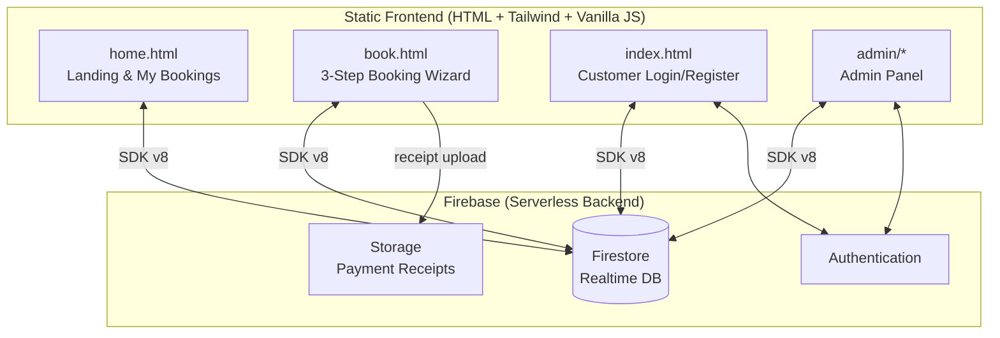

# 🎾 Padel Pro — Court Booking Platform

A full bilingual Arabic/English booking platform for padel courts, built as a practical portfolio project using a lightweight serverless architecture powered by **Firebase Auth, Firestore, and Storage**.

The platform replaces manual WhatsApp, phone-call, and paper-based reservations with a structured digital workflow for customers and club admins.


---

## 📸 Screenshots

### Customer experience

| Home | Booking wizard — pick a slot |
|---|---|
|  |  |

| Booking details & payment | My bookings |
|---|---|
|  |  |

### Admin panel

| Overview | Bookings management |
|---|---|
|  |  |

| Customers | Courts | Reports |
|---|---|---|
|  |  |  |

---

## 💡 The Idea

Padel is one of the fastest-growing sports in Egypt and the Middle East, but many courts are still booked manually through phone calls, WhatsApp messages, and paper notebooks.

This creates common operational problems:

- Double bookings
- Missed or forgotten reservations
- No-shows
- Lost payment records
- Manual admin workload
- Limited visibility into revenue and court occupancy

**Padel Pro** digitizes the booking workflow end to end for both players and club owners.

- **Players** can view court availability, book a slot through a simple 3-step flow, add extras, choose payment method, upload receipts, and manage their bookings.
- **Owners/Admins** can manage bookings, courts, customers, payments, reports, blocked slots, and daily operations through a dedicated admin dashboard.

---


## 🎯 Goals

1. Eliminate double bookings with a real-time availability system.
2. Reduce manual admin work and paper-based tracking.
3. Provide customers with a modern self-service booking experience.
4. Support Arabic and English users with full RTL/LTR interface switching.
5. Keep hosting and maintenance overhead low using a serverless Firebase stack.

---

## ✨ Features

### Customer side

- 🌍 **Arabic/English localization** with proper RTL/LTR switching.
- 🌙 **Dark mode support** for a modern user experience.
- 📱 **Phone-based account flow** using Firebase authentication.
- 🗓️ **3-step booking wizard**: choose court & time → enter details & extras → choose payment.
- ⚡ **Real-time availability** powered by Firestore.
- 🚫 **Blocked slots handling** for maintenance or private events.
- ☕ **Add-on services** such as drinks or extras attached to bookings.
- 💳 **Payment options**: pay on arrival or InstaPay with QR/payment link.
- 📤 **Receipt upload** for payment verification.
- 🧾 **My Bookings** page with booking references and printable invoices.

### Admin side

- 🔐 **Secure admin login** using Firebase Auth with role verification.
- 📊 **Dashboard overview** with live stats for bookings, revenue, occupancy, and booking statuses.
- ✅ **Booking management**: confirm, cancel, filter, and review payment receipts.
- 🏟️ **Court management**: add/edit courts, pricing, opening hours, and blocked slots.
- ⚙️ **Central settings** stored in Firestore for contact info, payment details, and configuration.
- 👥 **Customers & debts**: customer directory with booking history, total spend, and outstanding-balance tracking.
- 📈 **Reports section** for tracking business performance and operational activity.

---

## 🏗️ Architecture



**Why serverless?** No server to deploy, patch, or pay for. Firestore's real-time listeners give live availability out of the box, Firebase Auth handles sessions and password security, and the static frontend can be hosted for free (Firebase Hosting / GitHub Pages / Netlify).

### Data model (Firestore collections)

| Collection | Purpose |
|---|---|
| `courts` | Court definitions: name, description, pricing, open hours |
| `bookings` | All bookings with status (`pending` / `confirmed` / `cancelled`), payment method & receipt |
| `public_bookings` | Minimal mirror of booked slots readable by guests, so availability never exposes customer data |
| `courtBlocks` | Admin-blocked slots (maintenance, private events) |
| `customers_users` | Customer profiles keyed by phone number |
| `drinks` | Add-on services catalog |
| `settings` | Central app configuration (contact, payments, notifications) |
| `staff_index` / `booking_meta` | Admin role lookup & booking counters |

> The `public_bookings` mirror is a deliberate design decision: guests can compute slot availability **without** read access to the main `bookings` collection, keeping customer names and phone numbers private at the security-rules level.

## 🚀 Getting Started

The frontend is fully static — you only need a Firebase project.

### 1. Create a Firebase project
1. Go to the [Firebase Console](https://console.firebase.google.com/) → **Add project**.
2. Enable **Authentication** → Sign-in method → **Email/Password**.
3. Create a **Firestore Database** (production mode).
4. Enable **Storage** (used for payment receipt uploads).

### 2. Connect the database
Register a **Web App** in Project Settings and copy your config object, then paste it in the placeholders in:

- `admin/firebase-config.js`
- `index.html`, `home.html`, `book.html` (inline config)

```js
const firebaseConfig = {
  apiKey:            "YOUR_FIREBASE_API_KEY",
  authDomain:        "YOUR_PROJECT.firebaseapp.com",
  projectId:         "YOUR_PROJECT_ID",
  storageBucket:     "YOUR_PROJECT.firebasestorage.app",
  messagingSenderId: "YOUR_SENDER_ID",
  appId:             "YOUR_APP_ID"
};
```

### 3. Create the admin account
1. In Firebase Auth, add a user (e.g. `admin@example.com`).
2. Put the same email in `HARDCODED_ADMINS` inside `admin/index.html` (or add it to the `staff_index` collection).

### 4. Secure Firestore
Web API keys are public by design — **security lives in the rules**. Baseline example:

```
rules_version = '2';
service cloud.firestore {
  match /databases/{database}/documents {
    match /courts/{id}        { allow read: if true; allow write: if isAdmin(); }
    match /public_bookings/{id} { allow read: if true; allow write: if request.auth != null; }
    match /bookings/{id}      { allow read, write: if request.auth != null; }
    match /customers_users/{id} { allow read, write: if request.auth != null; }
    match /settings/{id}      { allow read: if true; allow write: if isAdmin(); }
    function isAdmin() {
      return request.auth != null &&
        exists(/databases/$(database)/documents/staff_index/$(request.auth.token.email));
    }
  }
}
```

### 5. Run
Any static server works:

```bash
npx serve .
# or
python3 -m http.server 8080
```

Open `home.html` (customer site) or `admin/index.html` (admin panel).

## 📁 Project Structure

```
padel-pro/
├── home.html          # Landing page + My Bookings + invoices
├── book.html          # 3-step booking wizard + payments
├── index.html         # Customer login / registration
├── i18n.js            # AR/EN translation layer
└── admin/
    ├── index.html         # Admin login (role-verified)
    ├── dashboard.html     # Admin control panel
    ├── dashboard.js       # Bookings logic & live stats
    ├── courts.js          # Courts CRUD & slot blocking
    ├── firebase-config.js # Firebase initialization
    └── style.css          # Admin panel styles
```

🛣️ Roadmap
Online payment gateway — automatic payment confirmation via Paymob, Fawry, or Stripe.
Notifications — WhatsApp Business API or FCM push notifications for confirmations and reminders.
Multi-venue support — one deployment serving multiple clubs.
Framework migration — rebuild using React + TypeScript with Firebase v10 modular SDK.
Smart scheduling — peak/off-peak pricing and occupancy predictions.
Loyalty & memberships — points, subscriptions, recurring bookings, and customer plans.
Native mobile app — React Native or Flutter app connected to the same Firestore backend.
Testing & CI — E2E tests with Playwright and GitHub Actions.
🧠 What This Project Demonstrates

This project demonstrates building a real business-oriented web application end to end:

Translating a real business workflow into a digital system
Designing booking flows and admin operations
Using Firebase as a serverless backend
Implementing authentication and role-based access
Structuring Firestore collections for real-time availability
Handling file uploads for payment receipts
Supporting bilingual Arabic/English interfaces
Building RTL/LTR user experiences
Creating dashboards for bookings, customers, payments, and reports
Thinking about privacy through public/private booking data separation

## 📄 License

Published for demonstration and portfolio purposes — see [LICENSE](LICENSE).

---

**Yousef Ellawah** — [yousef.lawah@gmail.com](mailto:yousef.lawah@gmail.com)
