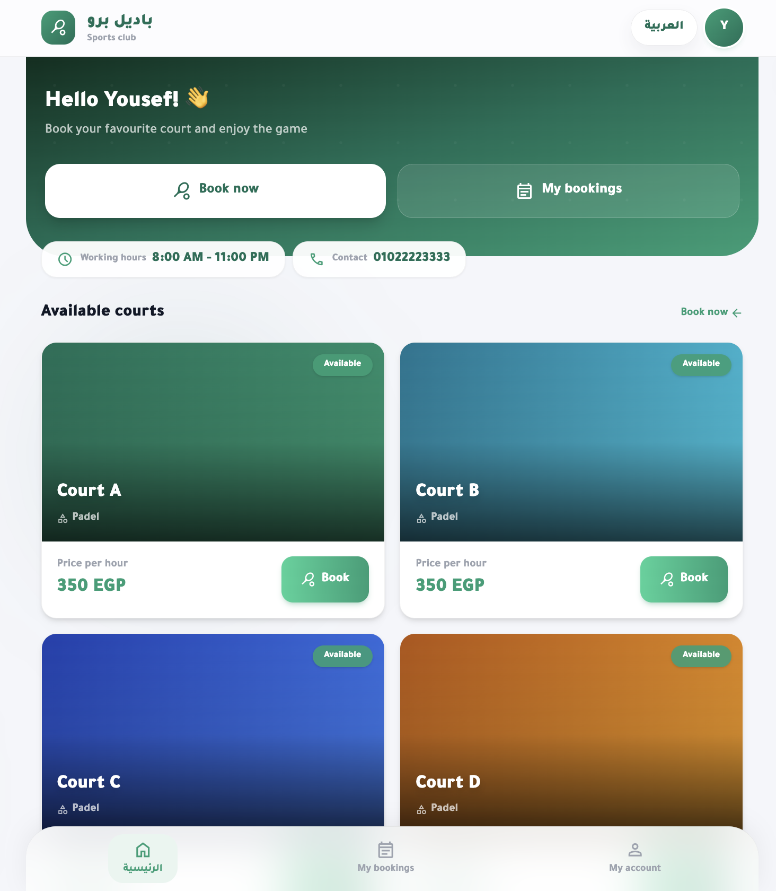
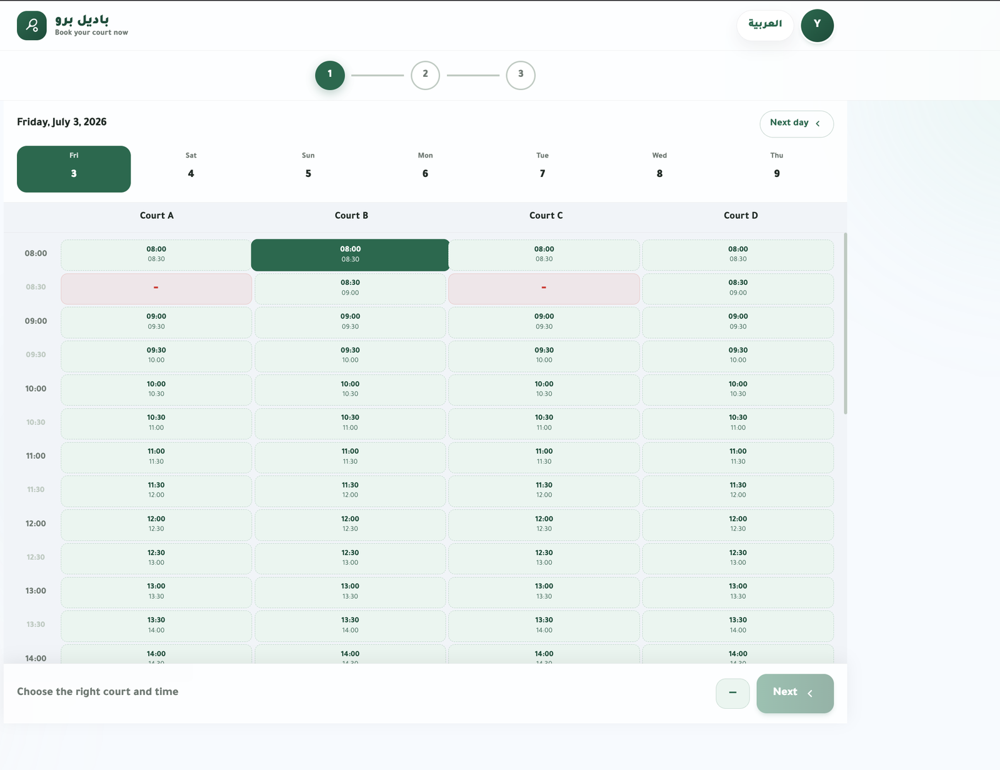
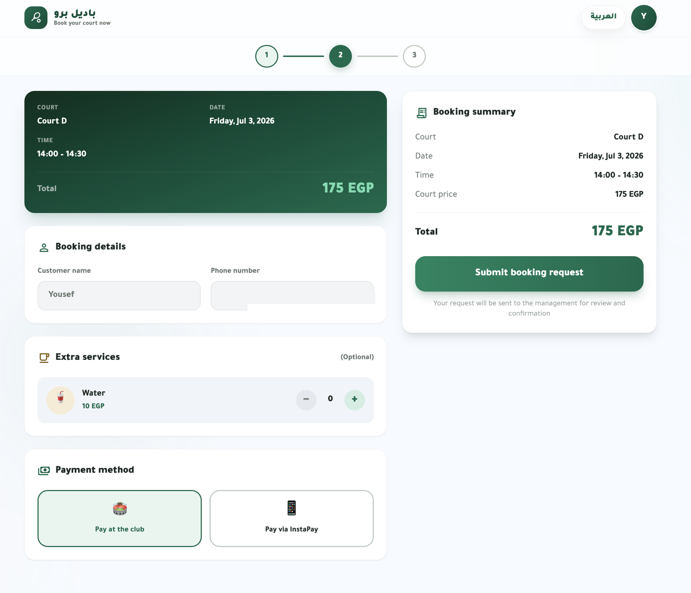
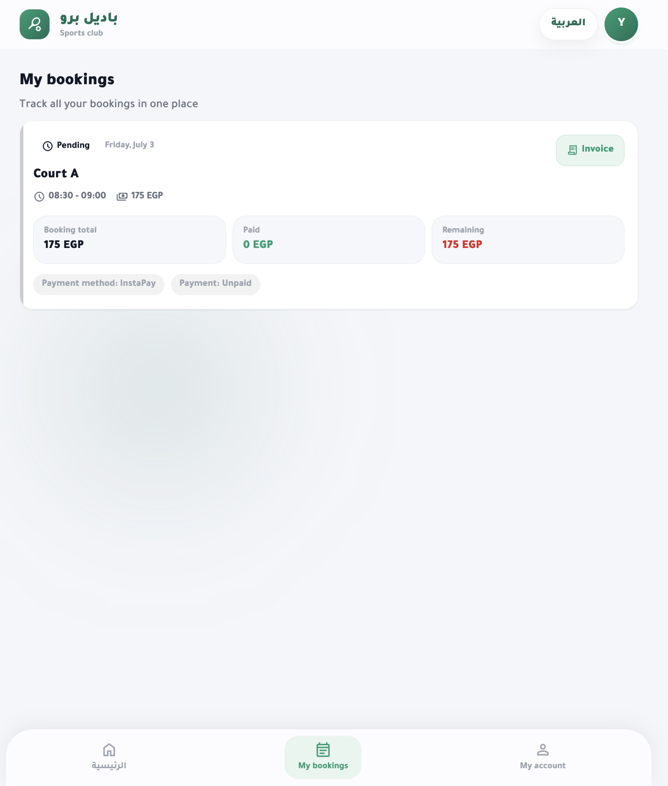
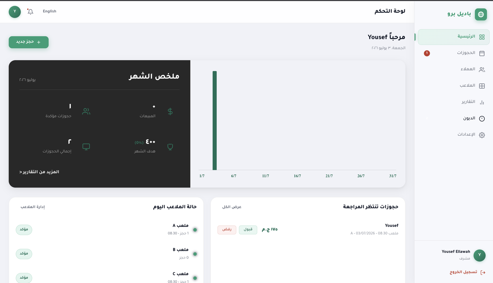
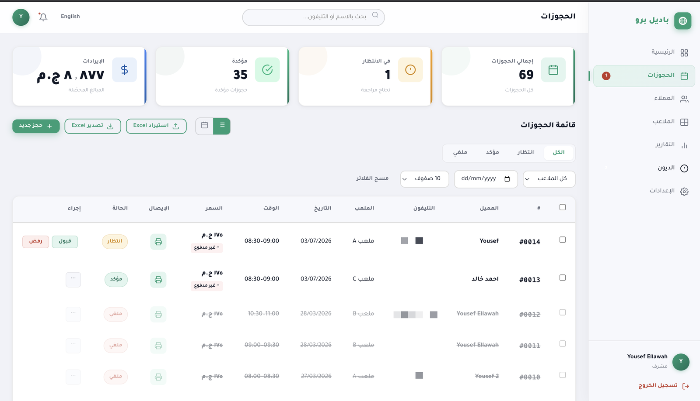
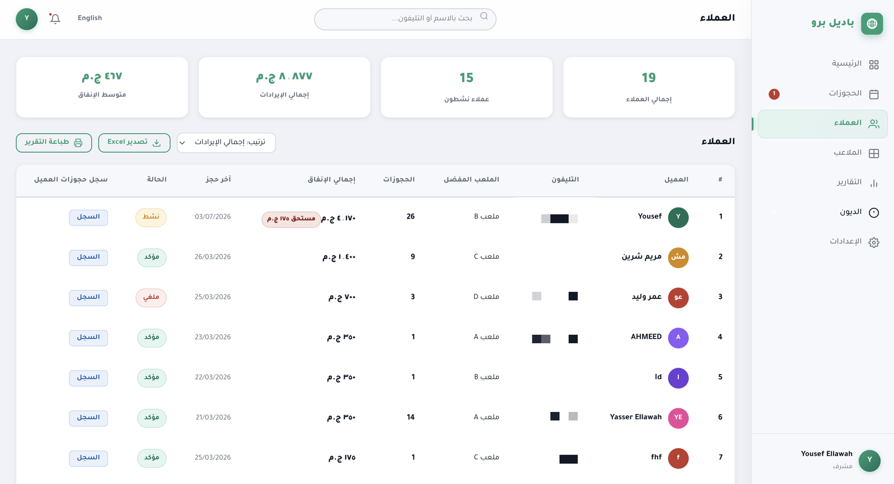
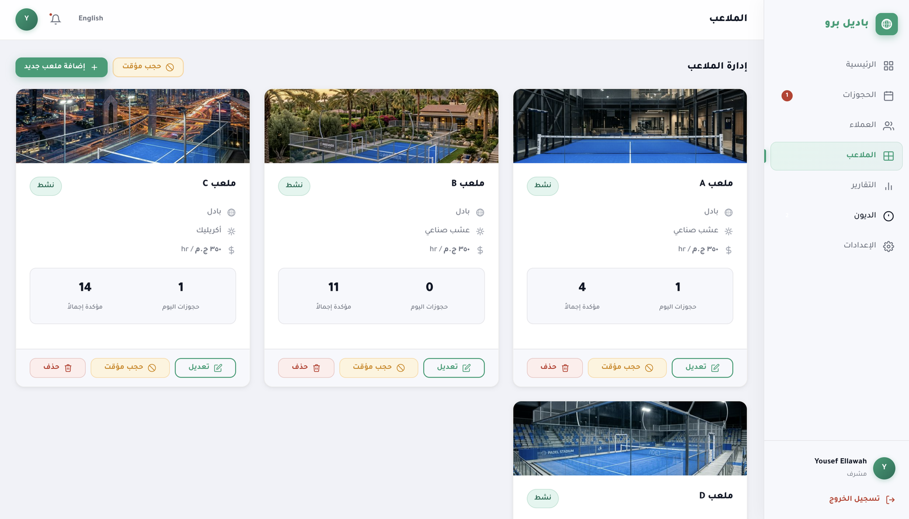
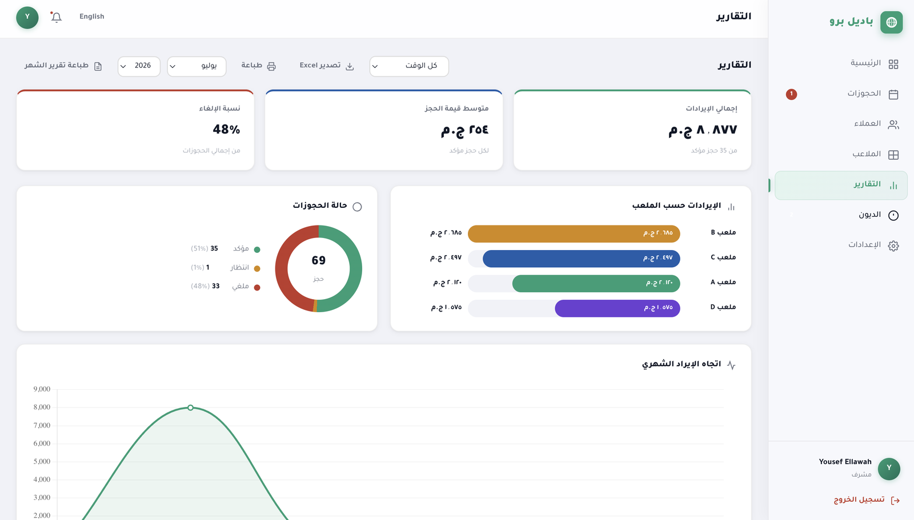
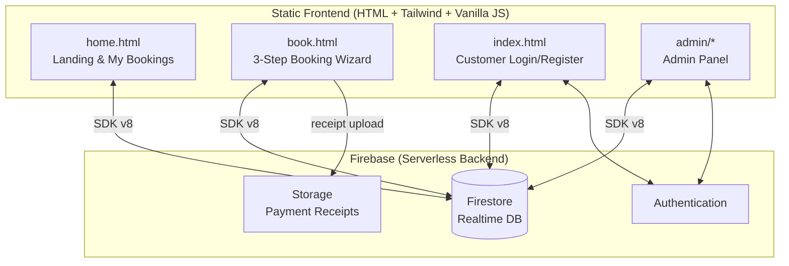

# 🎾 Padel Pro — Court Booking Platform

A full, production-ready **bilingual (Arabic/English) booking platform for padel courts**, built with a lightweight serverless architecture: a fast static frontend powered entirely by **Firebase** (Auth, Firestore, Storage) — no backend server to maintain, near-zero hosting cost.


---

## 📸 Screenshots

### Customer experience

| Home | Booking wizard — pick a slot |
|---|---|
|  |  |

| Booking details & payment | My bookings |
|---|---|
|  |  |

### Admin panel

| Overview | Bookings management |
|---|---|
|  |  |

| Customers | Courts | Reports |
|---|---|---|
|  |  |  |

## 💡 The Idea

Padel is one of the fastest-growing sports in Egypt and the Middle East, but most courts are still booked the old way: phone calls, WhatsApp messages, and paper notebooks. This leads to double bookings, no-shows, lost payment records, and zero visibility for the owner into how the business is performing.

**Padel Pro** digitizes the entire operation end-to-end:

- **Players** see real-time court availability, book a slot in a 3-step wizard, add extras (drinks/services), pay on arrival or via InstaPay (QR + payment link + receipt upload), and manage all their bookings from one place — with printable invoices.
- **Owners/Admins** get a secure control panel to confirm or reject bookings, review payment receipts, manage courts and pricing, block time slots for maintenance, and track revenue and occupancy.

## 🎯 Goals

1. Eliminate double bookings with a single real-time source of truth for availability.
2. Cut the admin's daily workload — no more manual notebook tracking.
3. Give customers a modern self-service experience in their own language (full Arabic RTL support).
4. Keep running costs near zero using a serverless stack — ideal for small sports businesses.

## ✨ Features

### Customer side
- 🌍 **Full Arabic/English localization** with proper RTL/LTR switching and dark mode.
- 📱 **Phone-based accounts** — players register with their phone number (synthesized into Firebase email auth under the hood).
- 🗓️ **3-step booking wizard**: pick court & time → enter details & extras → choose payment.
- ⚡ **Real-time availability** — slots update live from Firestore; blocked/maintenance slots are excluded automatically.
- ☕ **Add-on services** — drinks and extras can be attached to a booking.
- 💳 **Two payment flows**: pay on arrival, or InstaPay with QR code, direct payment link, and receipt image upload for verification.
- 🧾 **My Bookings** page with booking reference numbers and a printable booking invoice.

### Admin side
- 🔐 **Secure admin login** (Firebase Auth) with role verification — non-admin accounts are rejected.
- 📊 **Dashboard** with live stats: bookings, revenue, occupancy, and status breakdown.
- ✅ **Booking management** — confirm / cancel, filter by status, court, and date; review uploaded InstaPay receipts before confirming.
- 🏟️ **Courts management** — add/edit courts, set pricing, open hours, and block slots (maintenance / private events).
- ⚙️ **Settings** stored centrally in Firestore (contact info, notifications, payment details).
- 👥 **Customers & debts** *(latest production version)* — customer directory with booking history, total spend, and outstanding-balance tracking. The deployed version shown in the screenshots includes these newer modules; this repo contains the stable core snapshot.

## 🏗️ Architecture



**Why serverless?** No server to deploy, patch, or pay for. Firestore's real-time listeners give live availability out of the box, Firebase Auth handles sessions and password security, and the static frontend can be hosted for free (Firebase Hosting / GitHub Pages / Netlify).

### Data model (Firestore collections)

| Collection | Purpose |
|---|---|
| `courts` | Court definitions: name, description, pricing, open hours |
| `bookings` | All bookings with status (`pending` / `confirmed` / `cancelled`), payment method & receipt |
| `public_bookings` | Minimal mirror of booked slots readable by guests, so availability never exposes customer data |
| `courtBlocks` | Admin-blocked slots (maintenance, private events) |
| `customers_users` | Customer profiles keyed by phone number |
| `drinks` | Add-on services catalog |
| `settings` | Central app configuration (contact, payments, notifications) |
| `staff_index` / `booking_meta` | Admin role lookup & booking counters |

> The `public_bookings` mirror is a deliberate design decision: guests can compute slot availability **without** read access to the main `bookings` collection, keeping customer names and phone numbers private at the security-rules level.

## 🚀 Getting Started

The frontend is fully static — you only need a Firebase project.

### 1. Create a Firebase project
1. Go to the [Firebase Console](https://console.firebase.google.com/) → **Add project**.
2. Enable **Authentication** → Sign-in method → **Email/Password**.
3. Create a **Firestore Database** (production mode).
4. Enable **Storage** (used for payment receipt uploads).

### 2. Connect the database
Register a **Web App** in Project Settings and copy your config object, then paste it in the placeholders in:

- `admin/firebase-config.js`
- `index.html`, `home.html`, `book.html` (inline config)

```js
const firebaseConfig = {
  apiKey:            "YOUR_FIREBASE_API_KEY",
  authDomain:        "YOUR_PROJECT.firebaseapp.com",
  projectId:         "YOUR_PROJECT_ID",
  storageBucket:     "YOUR_PROJECT.firebasestorage.app",
  messagingSenderId: "YOUR_SENDER_ID",
  appId:             "YOUR_APP_ID"
};
```

### 3. Create the admin account
1. In Firebase Auth, add a user (e.g. `admin@example.com`).
2. Put the same email in `HARDCODED_ADMINS` inside `admin/index.html` (or add it to the `staff_index` collection).

### 4. Secure Firestore
Web API keys are public by design — **security lives in the rules**. Baseline example:

```
rules_version = '2';
service cloud.firestore {
  match /databases/{database}/documents {
    match /courts/{id}        { allow read: if true; allow write: if isAdmin(); }
    match /public_bookings/{id} { allow read: if true; allow write: if request.auth != null; }
    match /bookings/{id}      { allow read, write: if request.auth != null; }
    match /customers_users/{id} { allow read, write: if request.auth != null; }
    match /settings/{id}      { allow read: if true; allow write: if isAdmin(); }
    function isAdmin() {
      return request.auth != null &&
        exists(/databases/$(database)/documents/staff_index/$(request.auth.token.email));
    }
  }
}
```

### 5. Run
Any static server works:

```bash
npx serve .
# or
python3 -m http.server 8080
```

Open `home.html` (customer site) or `admin/index.html` (admin panel).

## 📁 Project Structure

```
padel-pro/
├── home.html          # Landing page + My Bookings + invoices
├── book.html          # 3-step booking wizard + payments
├── index.html         # Customer login / registration
├── i18n.js            # AR/EN translation layer
└── admin/
    ├── index.html         # Admin login (role-verified)
    ├── dashboard.html     # Admin control panel
    ├── dashboard.js       # Bookings logic & live stats
    ├── courts.js          # Courts CRUD & slot blocking
    ├── firebase-config.js # Firebase initialization
    └── style.css          # Admin panel styles
```

## 🛣️ Roadmap

- **Online payment gateway** — automatic payment confirmation via Paymob / Fawry / Stripe instead of manual receipt review.
- **Notifications** — WhatsApp Business API / FCM push for booking confirmations and reminders.
- **Multi-venue support** — one deployment serving multiple clubs, each with its own courts, staff, and branding.
- **Framework migration** — port the frontend to React + TypeScript with the Firebase v10 modular SDK (an admin dashboard prototype already exists).
- **Smart scheduling** — dynamic (peak/off-peak) pricing and occupancy predictions.
- **Loyalty & memberships** — points, subscriptions, and recurring bookings.
- **Native mobile app** — React Native / Flutter client on the same Firestore backend.
- **Testing & CI** — E2E tests with Playwright and GitHub Actions.

## 🧠 What this project demonstrates

Building a real product end-to-end: requirements from a real business domain, data modeling for privacy (public availability mirror vs. private bookings), authentication flows with role-based access, real-time UI on Firestore listeners, bilingual RTL/LTR UX, file uploads, and a payments flow designed around local payment habits (InstaPay + cash) — all delivered with zero backend infrastructure.

## 📄 License

Published for demonstration and portfolio purposes — see [LICENSE](LICENSE).

---

**Yousef Lawah** — [yousef.lawah@gmail.com](mailto:yousef.lawah@gmail.com)
